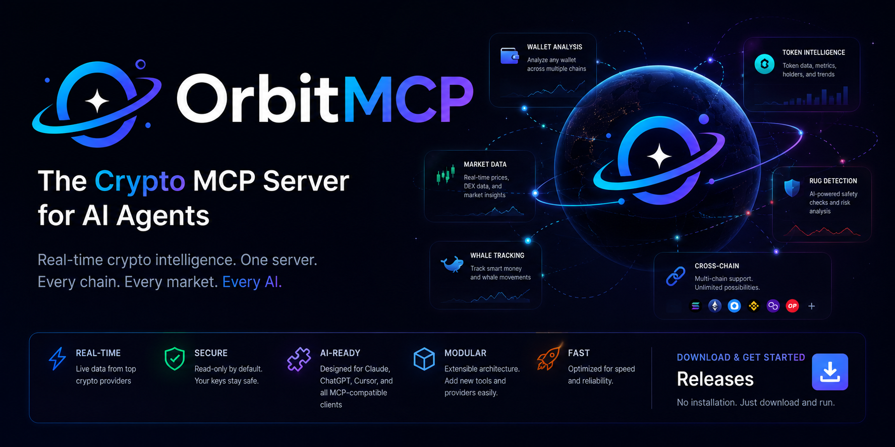

  

<h1 align="center">OrbitMCP</h1>

The Crypto MCP Server for AI Agents

Real-time crypto intelligence for Claude, ChatGPT, Cursor, VS Code, Windsurf and every MCP-compatible client.

  

---

## Download

Pre-built binaries are available in **Releases**.

| Platform | Download |
|----------|----------|
| Windows | `.exe` |
| macOS | `.dmg` |
| Linux | Binary |

No Python.

No Node.js.

No Docker.

Download → Launch → Connect.

---

## Screenshot

> Dashboard screenshot here

---

# Features

✅ Wallet Analysis

✅ Portfolio Analysis

✅ Live Prices

✅ Rug Detection

✅ Whale Tracking

✅ Token Scanner

✅ Trending Tokens

✅ Market Analytics

✅ Smart Contract Analysis

✅ AI-ready MCP Server

---

# Supported Providers

- CoinGecko
- DexScreener
- GeckoTerminal
- DefiLlama
- Birdeye
- Solscan
- Etherscan
- Hyperliquid
- Jupiter
- Pump.fun

---

# Supported Chains

- Solana
- Ethereum
- Base
- BNB Chain
- Polygon
- Arbitrum
- Optimism

---

# Installation

1. Open Releases.
2. Download the latest version.
3. Start OrbitMCP.
4. Connect your AI client.

Done.

---

# Example Prompts

Analyze this wallet.

Find new meme coins launched today.

Is this token a rug?

Show whales buying SOL.

Analyze my portfolio.

Find tokens with over $1M daily volume.

---

# Architecture

AI Client

↓

OrbitMCP

↓

Providers

↓

Blockchain

↓

Response

---

# Roadmap

## v1

- Wallet Analysis
- Token Analysis
- Live Prices
- Rug Detection

## v2

- Portfolio Tracking
- Alerts
- Whale Tracking
- Trending Scanner

## v3

- Trading Actions
- Copy Trading
- Hyperliquid
- AI Portfolio Manager

---

# Security

OrbitMCP never stores private keys or seed phrases.

Always verify transactions before signing.

---

# FAQ

### Is OrbitMCP free?

Yes.

### Does it work with Claude?

Yes.

### Does it support ChatGPT?

Yes.

### Does it support Solana?

Yes.

### Does it support Ethereum?

Yes.

---

# Contributing

Pull requests are welcome.

---

# License

MIT
